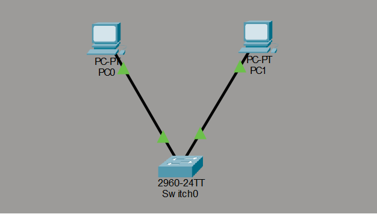

## LAB DAY 1 — Stage 1: Basic LAN

**Status:** Complete

**Overview**

This lab demonstrates a basic Local Area Network (LAN) built with two PCs connected via a switch. The exercise verifies connectivity using ICMP (ping) and inspects frame movement between the hosts.

**Objectives**

- Build a minimal LAN with two hosts and a switch
- Assign IPv4 addresses and verify addressing
- Test connectivity using ping
- Capture and observe frame delivery between hosts

**Network Topology**



**Network Addressing**

| Device | Interface |   IP address |   Subnet mask | Default gateway |
| ------ | --------- | -----------: | ------------: | --------------- |
| PC 0   | NIC       | 192.168.1.10 | 255.255.255.0 | N/A             |
| PC 1   | NIC       | 192.168.1.20 | 255.255.255.0 | N/A             |

> Notes: Default gateway is not used in this simple flat LAN (hosts are on the same subnet).

**IP configuration (screenshots)**


**Testing and Results**

Connectivity was verified using the ping command between the two PCs. All pings succeeded and frames were observed being delivered between hosts.

Commands used:

```bash
# From PC 0
ping 192.168.1.20

# From PC 1
ping 192.168.1.10
```


**Files included**

- Stage 1 basic LAN.pkt — Packet Tracer project file
- topology.png — Topology diagram
- ip configurations.png — Host IP screenshots
- simulation.png — Simulation overview
- ping.png — Ping result screenshot

**Observations**

- The two hosts communicate directly since they're on the same subnet.
- No gateway was required for host-to-host traffic.

If you'd like, I can also add a small ASCII topology, update default gateway values, or include a short packet capture example.
